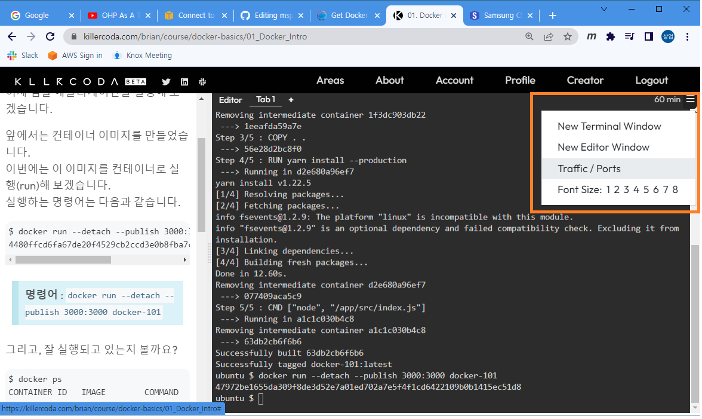
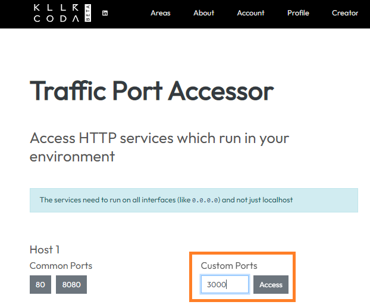

# Docker & Kubernetes 노트 (MSP T2 23-2차) (●'◡'●)
## Q&A

### Docker

- App별로 다른 OS를 사용한다면, OS를 공유하는 컨테이너는 사용 못하는건가요?
  - 아니오, 그렇지 않습니다.
  - OS Kernel 을 공유하고, 배포판별로 달라지는 건 컨테이너 이미지를 만들 때 다른 배포판을 사용해서 만들 수 있습니다.
  - 예를들어, 같은 Kernel위에서 Ubuntu와 CentOS 기반의 애플리케이션을 모두 실행할 수 있습니다.

- OS가 다양하고 이미지에 포함된 것 같은데, OS가 다양하면 그만큼 인프라 자원을 사용하게 되나요?
  - 인프라 자원은 한정적이기 때문에 Control group을 이용하여 자원을 적절히 나눠서 쓰게 됩니다.

- Hypervisor라는 레이어는 어떤 역할을 해주는건가요?
  - 가상머신(Virtual machine)을 제공해주기 위해서 사용되는 가상화솔루션 입니다.
  - 

- 코드와 종속성을 패키징 하는 소프트웨어의 표준 단위입니다. 에서 `종속성`은 무엇을 의미하나요?
  - App. 을 위한 코드도 필요하지만, 여러가지 종속된 라이브러리나 오픈소스 패키지들이 필요할 수 있습니다. 그 부분을 모두 컨테이너에 담는다는 의미입니다.
  - 예를들어 A 시스템이 Log4j를 이용한다면 그 부분도 패키징한다는 의미입니다.

- Container 와 VM 비교에서 VM이 격리/보안 측면에서 더 좋다고 했는데, 어떤 부분이 더 좋은건가요?
  - Volume파트를 보시면 좀 더 도움이 될 것 같습니다.
  - Container는 Host의 파일시스템이나 네트워크를 직접 사용하는 방법을 제공합니다. (잘 못 사용하면, 다른 컨테이너나 Host의 프로세스에 영향을 줄 수 있습니다.)
  - VM은 OS가 분리되어 있기 때문에, 위와같은 위험성은 상대적으로 적습니다.

- [Killercoda](https://killercoda.com/) 에서 포트접속 방법 다시 알려주세요.
  - 우측상단 메뉴 > Traffic/Ports > Custom Ports에 접속하려는 포트 설정 후 `Access`버튼 클릭




- Registry를 로컬 서버에 구축할 수 있는건가요?
  - 네, 가능합니다.
  - [Docker Registry - Basic commands](https://docs.docker.com/registry/#basic-commands) 의 **Start your registry** 부분 참고하세요.
  - 위 방법 말고도, Private registry를 구축하는 다양한 방법이 있습니다. (e.g. [Harbor](https://goharbor.io/) 와 같은 솔루션을 사용)

- 만약 서로다른 레이어인데 같은 경로의 같은 이름의 파일이 있다면 어떻게 되나요?
  - 위의 레이어가 우선합니다.

- Container는 Instance라고 했는데, 해당 레이어(Container layer)의 내용은 휘발성인가요?
  - 네, 맞습니다.
  - 그래서 뒤에 Volume이라는 걸 배울 예정입니다. (휘발성 레이어의 내용을 기록하는 방법)

- 해당 Layer가 이미 Image로 포함되었는데, 사라지지는 않겠죠?
  - 네, Image레이어는 Read only이고 사라지지 않습니다.
  - 단, 컨테이너가 실행되는 동안에 Container layer에서 Image layer의 내용을 삭제(실제로 삭제되지은 않고, 위의 레이어에서 삭제처리만 함)할 수는 있습니다.
  - 위의 경우에도 같은 Image layer를 사용하는 다른 컨테이너에서는 삭제되지 않은 상태로 사용 가능합니다.

- 이미지의 레이어들 중 가장 위의 0B 레이어는 어떤 의미인가요?
  - 교재 그림의 가장 위 레이어를 말씀하시는 것 같습니다.
  - 특별한 의미는 없고, 예시인 것 같습니다.
  - 보통은 각 레이어마다 파일들이 존재하기 때문에 어느정도의 사이즈를 가지고 있습니다.

- LB로 컨테이너를 여러개 실행하면 컨테이너 레벨에서 레이어를 쌓은건 복사 안되고, 이미지 단계에서 쌓은 레이어가 여러개가 되는건가요?
  - Image layer들의 내용은 공유를 하고(같은 파일시스템의 파일을 사용하고), 각 컨테이너의 레이어만 별도로 가지게 됩니다.

- 컨테이너가 여러개 있다면 정합성 문제는 없나요?
  - 그런 문제들은 애플리케이션에서 해결해야 합니다. (자동으로 동기화 되지는 않습니다.)
  - 예를들어 DB 라면 각 컨테이너별로 데이터를 replication해야 합니다.

- Base image는 누군가 만들어놓은 거라고 했는데, 공유된것만 쓰나요? 내가 만들어둔걸 쓸 수도 있나요?
  - 다 가능합니다.
  - [Docker Hub](https://hub.docker.com/)와 같은곳에 공개된 Image를 Base로 할 수도 있고, Private registry에 있는 우리 팀의 이미지를 Base로 할 수도 있습니다.
  - 나만의 이미지를 만들어서, 그걸 Base로 할 수도 있습니다. (Registry에 공유하지 않고)

- Run을 실행하는 시점에 Container layer가 daemon에 의해서 생성된다고 보며 될까요?
  - 네, 맞습니다.

- 동일한 실행 파일(이미지)을 detatched와 foreground모드로 다 실행 가능한가요?
  - 네, 대부분 가능합니다.
  - 보통 Web application같은 경우는 detached 형태로 실행하는 경우가 많습니다. 하지만, foreground모드로 실행하고 shell 명령어를 이용해서 개발단계나 디버깅 시 살펴볼 수 있습니다.
  
- docker stop이나 run명령어 실행 시 특정 컨테이너나 이미지를 지정하지 않으면 모든 이미지에 적용되나요?
  - 아니오, 그렇지 않습니다.
  - 컨테이너를 조작하는 명령어는 뒤에 컨테이너를, 이미지를 조작하는 명령어는 뒤에 이미지를 주도록 되어있습니다. 지정하지 않으면 에러가 발생합니다.

- Attach와 exec의 차이는 attach는 컨테이너 내부로 진입(attach)하는 것이고, exec는 바로 명령어를 실행시키는건가요?
  - 네, 맞습니다.
  - 예를들어 아래와 같은것이 가능합니다. (docker exec my-ubuntu bash -c "cat /etc/os-release")

```bash
ubuntu@ip-10-0-3-56:~$ docker ps
CONTAINER ID   IMAGE     COMMAND   CREATED         STATUS         PORTS     NAMES
e0d3f83c223b   ubuntu    "bash"    6 seconds ago   Up 6 seconds             my-ubuntu
ubuntu@ip-10-0-3-56:~$ docker exec my-ubuntu bash -c "cat /etc/os-release"
PRETTY_NAME="Ubuntu 22.04.1 LTS"
NAME="Ubuntu"
VERSION_ID="22.04"
VERSION="22.04.1 LTS (Jammy Jellyfish)"
VERSION_CODENAME=jammy
ID=ubuntu
ID_LIKE=debian
HOME_URL="https://www.ubuntu.com/"
SUPPORT_URL="https://help.ubuntu.com/"
BUG_REPORT_URL="https://bugs.launchpad.net/ubuntu/"
PRIVACY_POLICY_URL="https://www.ubuntu.com/legal/terms-and-policies/privacy-policy"
UBUNTU_CODENAME=jammy
```

- search할 때 레지스트리 위치는 선택할 수 있는건가요?
  - 

- ReDii같은 또는 개인 Custom registry는 config로 어딘가에 등록해 놓고 pull, push할 수 있는건가요?
  - `docker login` 명령어를 실행하고 나면 그 다음부터는 로그인 한 registry에서 push, push를 합니다.
  - 일반적으로 사내에서 업무시스템을 운영한다고 하면, ReDii에 로그인 하고 ReDii에서 이미지를 pull하여 실행합니다.

- `Docker Commit`은 어떤경우에 사용하나요?
  - 컨테이너를 실행해서 발생한 파일시스템상의 변경사항 (파일의 생성/수정/삭제)을 포함해서 새로운 이미지를 만들 때 사용됩니다.
  - 

- Base image를 사용하지 않으면 그냥 커널OS를 사용하는 걸까요?
  - 애플리케이션을 실행하기 위해서 필요한 부분만 넣어서 이미지를 만들 수 있습니다.
  - Base image를 사용하지 않는 유형은 뒤에서 배울 FROM instruction에 scratch를 설정하는 방법입니다.
  - 이 상태에서 필요한 파일들만 추가해서 이미지를 만들 수 있습니다.

- Bind mounts는 같은 컨테이너가 바라볼 수 없거나 컨테이너간 공유가 안되는건가요?
  - 그렇지는 않습니다.
  - 기본적인 동작은 Volume과 같습니다.
  - 저장되는 위치가 달라지는 것입니다.
  - 아래는 bind mount유형으로 두 개의 컨테이너를 실행해서 같은 경로를 마운트한 경우입니다. (같은 파일이 보입니다.)

```bash
ubuntu $ ls -al /volume/bindmount/
total 8
drwxr-xr-x 2 root root 4096 Jan 17 05:55 .
drwxr-xr-x 3 root root 4096 Jan 17 05:55 ..
-rw-r--r-- 1 root root    0 Jan 17 05:55 mspt2
ubuntu $ docker run -it --name ubuntu1 -v /volume/bindmount:/tmp ubuntu
Unable to find image 'ubuntu:latest' locally
latest: Pulling from library/ubuntu
6e3729cf69e0: Pull complete 
Digest: sha256:27cb6e6ccef575a4698b66f5de06c7ecd61589132d5a91d098f7f3f9285415a9
Status: Downloaded newer image for ubuntu:latest
root@eeba64471e62:/# ls -al /tmp
total 8
drwxr-xr-x 2 root root 4096 Jan 17 05:55 .
drwxr-xr-x 1 root root 4096 Jan 17 05:57 ..
-rw-r--r-- 1 root root    0 Jan 17 05:55 mspt2
root@eeba64471e62:/# ubuntu $ 
ubuntu $ docker run -it --name ubuntu2 -v /volume/bindmount:/tmp ubuntu
root@4159e59a2ea8:/# ls -al /tmp
total 8
drwxr-xr-x 2 root root 4096 Jan 17 05:55 .
drwxr-xr-x 1 root root 4096 Jan 17 05:57 ..
-rw-r--r-- 1 root root    0 Jan 17 05:55 mspt2
root@4159e59a2ea8:/# ubuntu $
```

- 꼭 `docker volume create`로 만들고 사용해야 하나요?
  - 아니오, 뒤에 예제에서 그렇지 않은 경우도 다루고 있습니다. (없으면 알아서 자동으로 만들어줍니다.)
  
- 뒤의 목표(target) 이름은 임의로 입력할 수 있는건가요?
  - Container에서 사용할 파일시스템 경로를 입력하면 됩니다.
  - 없는 경우 디렉토리를 만들어줍니다.


- Volume 만들 때 용량은 지정할 수 있나요?

  
- Bind mount를 할 때 경로를 Volume의 경로로 지정할 수도 있는건가요? 그럼, 동일한 개념으로 사용되나요?
  - 지정은 할 수 있지만, 다른 개념입니다.
  - Volume은 도커의 Object로 관리가 되고, Bind mount 경로는 단지 Host 머신의 경로에 마운트되어 사용될 뿐입니다.
  
- 브릿지는 G/W IP랑 같을 수 있나요?
  - G/W IP와 Subnet 아이피 대역이 지정되어 있습니다.
  - 컨테이너는 subnet 대역 내에서 아이피를 할당받게 됩니다. (자동, 혹수 수동 지정도 가능합니다.)

- Bridge네트워크를 사용하면 Host를 사용하는 것에 대비해 장점이 있나요?
  - 같은 설정의 컨테이너라면, Host네트워크인 경우 여러개를 동시에 실행할 수 없습니다. (e.g. 80포트를 사용하는 웹서버)
  - 하지만, Bridge 네트워크는 같은 설정의 컨테이너를 실행하더라도 host에 노출되는 port를 달리해서 실행할 수 있습니다.
  
- ReDii는 SDS의 Private registry이름이라고 했는데, 상용이나 일반용어가 아닌 SDS에서 사용하는 용어인가요?
  - 네, 맞습니다. 그냥 Private registry에 이름을 ReDii라고 붙여놓은 것입니다. (뭔가의 약자일 것 같긴 한데, 저도 잘... ^^)

- `--network-alias mysql` 와 `--env MYSQL_HOST=mysql` 은 host file의 IP alias와 같은 기능이라고 보면 될까요?
  - 네, 같은 기능이라고 보시면 됩니다.
  - Container도 동적으로 IP를 할당받긴 하지만, IP를 가지고 네트워크를 구성하는것은 비효율적이어서 alias를 지정하고 사용합니다.

- Volume 사용 시 default경로로 외장 스토리지를 mount해야 하므로 Bind mount가 좀 더 유리할 것 같은데, OS상의 directory rwx mode를 조정해서 권한관련 취약점을 제거할 수 있는 방법은 없는가요?

- 현업에서는 Volume을 더 많이 사용하나요?
  - Kubernetes를 통해서 사용하는 경우가 많기 때문에, Kubernetes의 Volume을 사용합니다. (내일 배우게됩니다.)

- 이미지 빌드할 때 EXPOSE를 안해줬거나 다른 포트를 expose했는데, docker run할 때 다른 포트로 열면 통신이 안되나요?

- 도커빌드를 젠킨스에서 실행 시 빌드한 jar파일을 젠킨스 내부 저장소에 가지고 있나요? ... 생략 ...

- 업무중에는 컨테이너를 먼저 할당받고 이 후 app 이미지를 할당받은 컨테이너에 배포하는 방식으로 진행했는데요, 컨테이너가 이미지를 실행한 인스턴스라고 해서 혼란스러워요. .... 생략 ...


